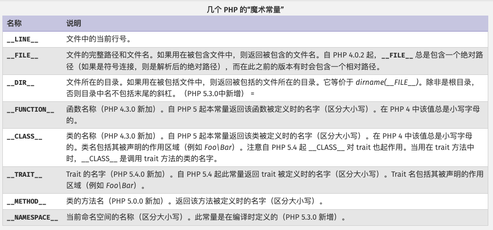

## 语法

可以用 [define()](https://www.php.net/manual/zh/function.define.php) 函数来定义常量，在 PHP 5.3.0 以后，可以使用 *const* 关键字在类定义之外定义常量。一个常量一旦被定义，就不能再改变或者取消定义。

常量只能包含标量数据（[boolean](https://www.php.net/manual/zh/language.types.boolean.php)，[integer](https://www.php.net/manual/zh/language.types.integer.php)，[float](https://www.php.net/manual/zh/language.types.float.php) 和 [string](https://www.php.net/manual/zh/language.types.string.php)）。可以定义 [resource](https://www.php.net/manual/zh/language.types.resource.php) 常量，但应尽量避免，因为会造成不可预料的结果。

可以简单的通过指定其名字来取得常量的值，与变量不同，*不应该*在常量前面加上 *$* 符号。如果常量名是动态的，也可以用函数 [constant()](https://www.php.net/manual/zh/function.constant.php) 来获取常量的值。用 [get_defined_constants()](https://www.php.net/manual/zh/function.get-defined-constants.php) 可以获得所有已定义的常量列表。

> **Note**: 常量和（全局）变量在不同的名字空间中。这意味着例如 **`TRUE`** 和 $TRUE 是不同的。

如果使用了一个未定义的常量，PHP 假定想要的是该常量本身的名字，如同用字符串调用它一样（CONSTANT 对应 "CONSTANT"）。此时将发出一个 [E_NOTICE](https://www.php.net/manual/zh/ref.errorfunc.php) 级的错误。参见手册中为什么 [$foo[bar\]](https://www.php.net/manual/zh/language.types.array.php#language.types.array.foo-bar) 是错误的（除非事先用 [define()](https://www.php.net/manual/zh/function.define.php) 将 *bar* 定义为一个常量）。如果只想检查是否定义了某常量，用 [defined()](https://www.php.net/manual/zh/function.defined.php) 函数。

常量和变量有如下不同：

- 常量前面没有美元符号（*$*）；
- 常量只能用 [define()](https://www.php.net/manual/zh/function.define.php) 函数定义，而不能通过赋值语句；
- 常量可以不用理会变量的作用域而在任何地方定义和访问；
- 常量一旦定义就不能被重新定义或者取消定义；
- 常量的值只能是标量。

> **Note**:
>
> 和使用 [define()](https://www.php.net/manual/zh/function.define.php) 来定义常量相反的是，使用 *const* 关键字定义常量必须处于最顶端的作用区域，因为用此方法是在编译时定义的。这就意味着不能在函数内，循环内以及 *if* 语句之内用 *const* 来定义常量。

## 魔术常量

PHP 向它运行的任何脚本提供了大量的[预定义常量](https://www.php.net/manual/zh/reserved.constants.php)。不过很多常量都是由不同的扩展库定义的，只有在加载了这些扩展库时才会出现，或者动态加载后，或者在编译时已经包括进去了。

有八个魔术常量它们的值随着它们在代码中的位置改变而改变。例如 **`__LINE__`** 的值就依赖于它在脚本中所处的行来决定。这些特殊的常量不区分大小写，如下：

参见 [get_class()](https://www.php.net/manual/zh/function.get-class.php)，[get_object_vars()](https://www.php.net/manual/zh/function.get-object-vars.php)，[file_exists()](https://www.php.net/manual/zh/function.file-exists.php) 和 [function_exists()](https://www.php.net/manual/zh/function.function-exists.php)。