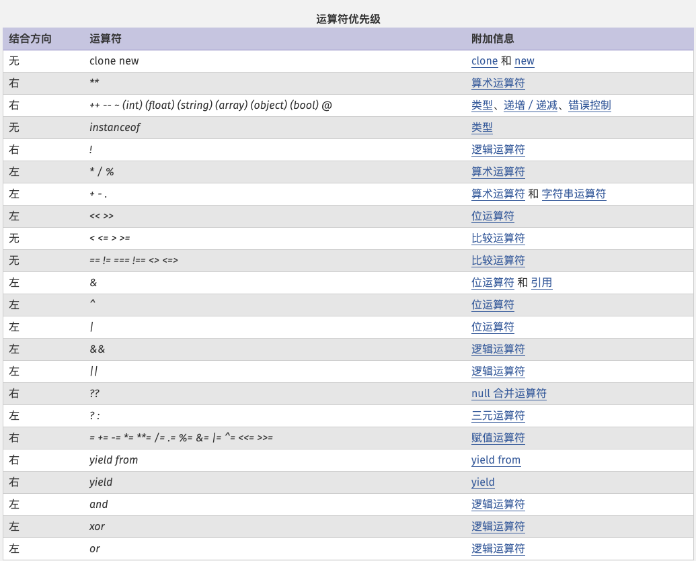
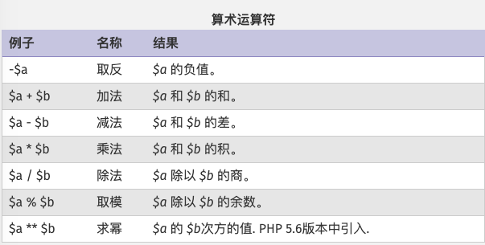
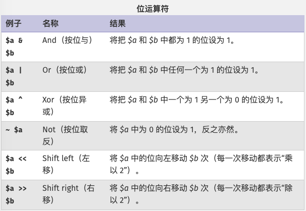
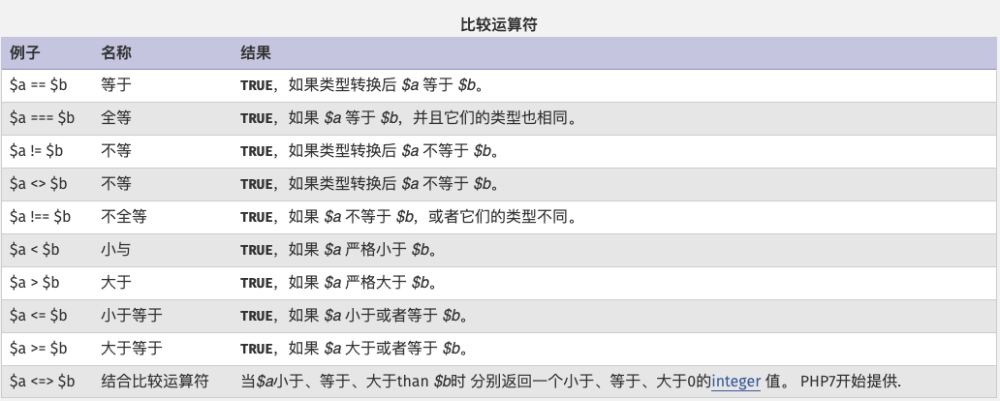
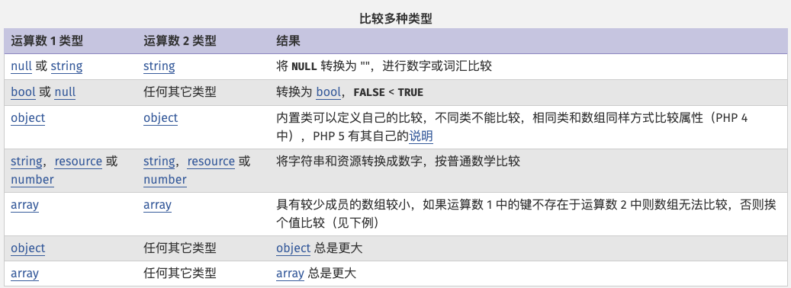

# 运算符

- [运算符优先级](https://www.php.net/manual/zh/language.operators.precedence.php)
- [算术运算符](https://www.php.net/manual/zh/language.operators.arithmetic.php)
- [赋值运算符](https://www.php.net/manual/zh/language.operators.assignment.php)
- [位运算符](https://www.php.net/manual/zh/language.operators.bitwise.php)
- [比较运算符](https://www.php.net/manual/zh/language.operators.comparison.php)
- [错误控制运算符](https://www.php.net/manual/zh/language.operators.errorcontrol.php)
- [执行运算符](https://www.php.net/manual/zh/language.operators.execution.php)
- [递增／递减运算符](https://www.php.net/manual/zh/language.operators.increment.php)
- [逻辑运算符](https://www.php.net/manual/zh/language.operators.logical.php)
- [字符串运算符](https://www.php.net/manual/zh/language.operators.string.php)
- [数组运算符](https://www.php.net/manual/zh/language.operators.array.php)
- [类型运算符](https://www.php.net/manual/zh/language.operators.type.php)

> 运算符是可以通过给出的一或多个值（用编程行话来说，表达式）来产生另一个值（因而整个结构成为一个表达式）的东西。
>
> 运算符可按照其能接受几个值来分组。一元运算符只能接受一个值，例如 *!*（[逻辑取反运算符](https://www.php.net/manual/zh/language.operators.logical.php)）或 *++*（[递增运算符](https://www.php.net/manual/zh/language.operators.increment.php)）。 二元运算符可接受两个值，例如熟悉的[算术运算符](https://www.php.net/manual/zh/language.operators.arithmetic.php) *+*（加）和 *-*（减），大多数 PHP 运算符都是这种。最后是唯一的[三元运算符](https://www.php.net/manual/zh/language.operators.comparison.php#language.operators.comparison.ternary) *? :*，可接受三个值；通常就简单称之为“三元运算符”（尽管称之为条件运算符可能更合适）。


## 运算符优先级

运算符优先级指定了两个表达式绑定得有多“紧密”。例如，表达式 *1 + 5 \* 3* 的结果是 *16* 而不是 *18* 是因为乘号（“*”）的优先级比加号（“+”）高。必要时可以用括号来强制改变优先级。例如：*(1 + 5) \* 3* 的值为 *18*。

如果运算符优先级相同，那运算符的结合方向决定了该如何运算。例如，"-"是左联的，那么 *1 - 2 - 3* 就等同于 *(1 - 2) - 3* 并且结果是 *-4*. 另外一方面，"="是右联的，所以 *$a = $b = $c* 等同于 *$a = ($b = $c)*。

没有结合的相同优先级的运算符不能连在一起使用，例如 *1 < 2 > 1* 在PHP是不合法的。但另外一方面表达式 *1 <= 1 == 1* 是合法的, 因为 *==* 的优先级低于 *<=*。

括号的使用，哪怕在不是必要的场合下，通过括号的配对来明确标明运算顺序，而非靠运算符优先级和结合性来决定，通常能够增加代码的可读性。




## 算数运算符



除法运算符总是返回浮点数。只有在下列情况例外：两个操作数都是整数（或字符串转换成的整数）并且正好能整除，这时它返回一个整数。 整数除法可参考 [intdiv()](https://www.php.net/manual/zh/function.intdiv.php)。

取模运算符的操作数在运算之前都会转换成整数（除去小数部分）。 浮点数取模可参考 [fmod()](https://www.php.net/manual/zh/function.fmod.php)。

取模运算符 *%* 的结果和被除数的符号（正负号）相同。即 *$a % $b* 的结果和 $a 的符号相同。例如：

```php
<?php

echo (5 % 3)."\n";           // prints 2
echo (5 % -3)."\n";          // prints 2
echo (-5 % 3)."\n";          // prints -2
echo (-5 % -3)."\n";         // prints -2

?>
```


## 赋值运算符

基本的赋值运算符是“=”。一开始可能会以为它是“等于”，其实不是的。它实际上意味着把右边表达式的值赋给左边的运算数。

在基本赋值运算符之外，还有适合于所有[二元算术](https://www.php.net/manual/zh/language.operators.php)，数组集合和字符串运算符的“组合运算符”，这样可以在一个表达式中使用它的值并把表达式的结果赋给它。例如： `+=`   或  ` .=`

注意赋值运算将原变量的值拷贝到新变量中（传值赋值），所以改变其中一个并不影响另一个。这也适合于在密集循环中拷贝一些值例如大数组。

在 PHP 中普通的传值赋值行为有个例外就是碰到对象 [object](https://www.php.net/manual/zh/language.types.object.php) 时，在 PHP 5 中是以引用赋值的，除非明确使用了 [clone](https://www.php.net/manual/zh/language.oop5.cloning.php) 关键字来拷贝。

### 引用赋值

PHP 支持引用赋值，使用“$var = &$othervar;”语法。引用赋值意味着两个变量指向了同一个数据，没有拷贝任何东西。

The [new](https://www.php.net/manual/zh/language.oop5.basic.php#language.oop5.basic.new) 运算符自动返回一个引用，因此在 PHP 7.0.0及之后的版本中禁止对 [new](https://www.php.net/manual/zh/language.oop5.basic.php#language.oop5.basic.new) 的结果进行引用赋值； PHP 5.3.0 及之后的版本则发出一条 **`E_DEPRECATED`** 错误信息；在更早的版本中发出的是 **`E_STRICT`**。


## 位运算符

位运算符允许对整型数中指定的位进行求值和操作。



位移在 PHP 中是数学运算。向任何方向移出去的位都被丢弃。左移时右侧以零填充，符号位被移走意味着正负号不被保留。右移时左侧以符号位填充，意味着正负号被保留。

要用括号确保想要的[优先级](https://www.php.net/manual/zh/language.operators.precedence.php)。例如 *$a & $b == true* 先进行比较再进行按位与；而 *($a & $b) == true* 则先进行按位与再进行比较。


## 比较运算符

比较运算符，如同它们名称所暗示的，允许对两个值进行比较。还可以参考 [PHP 类型比较表](https://www.php.net/manual/zh/types.comparisons.php)看不同类型相互比较的例子。



如果比较一个数字和字符串或者比较涉及到数字内容的字符串，则字符串会被[转换为数值](https://www.php.net/manual/zh/language.types.string.php#language.types.string.conversion)并且比较按照数值来进行。此规则也适用于 [switch](https://www.php.net/manual/zh/control-structures.switch.php) 语句。当用 === 或 !== 进行比较时则不进行类型转换，因为此时类型和数值都要比对。

对于多种类型，比较运算符根据下表比较（按顺序）。



### [三元运算符](https://www.php.net/manual/zh/language.operators.comparison.php#language.operators.comparison.ternary)

另一个条件运算符是“?:”（或三元）运算符 。

### [NULL 合并运算符](https://www.php.net/manual/zh/language.operators.comparison.php#language.operators.comparison.coalesce)

PHP 7 开始存在 "??" （NULL 合并）运算符。

PHP 7 新增加的 NULL 合并运算符（??）是用于执行isset()检测的三元运算的快捷方式。

NULL 合并运算符会判断变量是否存在且值不为NULL，如果是，它就会返回自身的值，否则返回它的第二个操作数。

```php
//三元运算符写法
$site = isset($_GET['site']) ? $_GET['site'] : 'yulongcode';
//NULL合并运算符写法
$site = $_GET['site'] ?? 'yulongcode';
```


## 错误控制运算符

### @

PHP 支持一个错误控制运算符：@。当将其放置在一个 PHP 表达式之前，该表达式可能产生的任何错误信息都被忽略掉。

如果用 [set_error_handler()](https://www.php.net/manual/zh/function.set-error-handler.php) 设定了自定义的错误处理函数，仍然会被调用，但是此错误处理函数可以（并且也应该）调用 [error_reporting()](https://www.php.net/manual/zh/function.error-reporting.php)，而该函数在出错语句前有 @ 时将返回 0。

如果激活了 [**track_errors** ](https://www.php.net/manual/zh/errorfunc.configuration.php#ini.track-errors)特性，表达式所产生的任何错误信息都被存放在变量 [$php_errormsg](https://www.php.net/manual/zh/reserved.variables.phperrormsg.php) 中。此变量在每次出错时都会被覆盖，所以如果想用它的话就要尽早检查。


## 执行运算符

PHP 支持一个执行运算符：反引号`（``）`。注意这不是单引号！PHP 将尝试将反引号中的内容作为 shell 命令来执行，并将其输出信息返回（即，可以赋给一个变量而不是简单地丢弃到标准输出）。使用反引号运算符“`”的效果与函数 [shell_exec()](https://www.php.net/manual/zh/function.shell-exec.php) 相同。

> **Note**:
>
> 反引号运算符在激活了[安全模式](https://www.php.net/manual/zh/ini.sect.safe-mode.php#ini.safe-mode)或者关闭了 [shell_exec()](https://www.php.net/manual/zh/function.shell-exec.php) 时是无效的。

> **Note**:
>
> 与其它某些语言不同，反引号不能在双引号字符串中使用。

参见PHP手册中[程序执行函数](https://www.php.net/manual/zh/ref.exec.php)，[popen()](https://www.php.net/manual/zh/function.popen.php)，[proc_open()](https://www.php.net/manual/zh/function.proc-open.php) 以及 [PHP 的命令行模式](https://www.php.net/manual/zh/features.commandline.php)。


## 递增/递减运算符

HP 支持 C 风格的前／后递增与递减运算符。

> **Note**: 递增／递减运算符不影响布尔值。递减 **`NULL`** 值也没有效果，但是递增 **`NULL`** 的结果是 *1*。


在处理字符变量的算数运算时，PHP 沿袭了 Perl 的习惯，而非 C 的。例如，在 Perl 中 *$a = 'Z'; $a++;* 将把 *$a* 变成*'AA'*，而在 C 中，*a = 'Z'; a++;* 将把 *a* 变成 *'['*（*'Z'* 的 ASCII 值是 90，*'['* 的 ASCII 值是 91）。注意字符变量只能递增，不能递减，并且只支持纯字母（a-z 和 A-Z）。递增／递减其他字符变量则无效，原字符串没有变化。

>  递增或递减布尔值没有效果。


## 逻辑运算符


“与”和“或”有两种不同形式运算符的原因是它们运算的优先级不同（见[运算符优先级](https://www.php.net/manual/zh/language.operators.precedence.php)）。

```php
<?php

// --------------------
// foo() 根本没机会被调用，被运算符“短路”了

$a = (false && foo());
$b = (true  || foo());
$c = (false and foo());
$d = (true  or  foo());

// --------------------
// "||" 比 "or" 的优先级高

// 表达式 (false || true) 的结果被赋给 $e
// 等同于：($e = (false || true))
$e = false || true;

// 常量 false 被赋给 $f，true 被忽略
// 等同于：(($f = false) or true)
$f = false or true;

var_dump($e, $f);

// --------------------
// "&&" 比 "and" 的优先级高

// 表达式 (true && false) 的结果被赋给 $g
// 等同于：($g = (true && false))
$g = true && false;

// 常量 true 被赋给 $h，false 被忽略
// 等同于：(($h = true) and false)
$h = true and false;

var_dump($g, $h);
?>
  
输出结果：
bool(true)
bool(false)
bool(false)
bool(true)
```


## 字符串运算符

有两个字符串（[string](https://www.php.net/manual/zh/language.types.string.php)）运算符。第一个是连接运算符（“.”），它返回其左右参数连接后的字符串。第二个是连接赋值运算符（“*.=*”），它将右边参数附加到左边的参数之后。更多信息见[赋值运算符](https://www.php.net/manual/zh/language.operators.assignment.php)。


## 数组运算符


*+* 运算符把右边的数组元素附加到左边的数组后面，两个数组中都有的键名，则只用左边数组中的，右边的被忽略。


## 类型运算符

*`instanceof`* 用于确定一个 PHP 变量是否属于某一类 [class](https://www.php.net/manual/zh/language.oop5.basic.php#language.oop5.basic.class) 的实例：

```php
<?php
class MyClass
{
}

class NotMyClass
{
}
$a = new MyClass;

var_dump($a instanceof MyClass);
var_dump($a instanceof NotMyClass);
?>
```

以上例程会输出：

```
bool(true)
bool(false)
```

*instanceof*　也可用来确定一个变量是不是继承自某一父类的子类的实例

检查一个对象是否*不是*某个类的实例，可以使用[逻辑运算符 *not*](https://www.php.net/manual/zh/language.operators.logical.php)。

如果被检测的变量不是对象，instanceof 并不发出任何错误信息而是返回 **`FALSE`**。不允许用来检测常量。

然而 instanceof 的使用还有一些陷阱必须了解。在 PHP 5.1.0 之前，如果要检查的类名称不存在，*instanceof* 会调用 [__autoload()](https://www.php.net/manual/zh/function.autoload.php)。另外，如果该类没有被装载则会产生一个致命错误。可以通过使用动态类引用或用一个包含类名的字符串变量来避开这种问题：

```php
<?php
$d = 'NotMyClass';
var_dump($a instanceof $d); // no fatal error here
?>
```

*instanceof* 运算符是 PHP 5 引进的。在此之前用 [is_a()](https://www.php.net/manual/zh/function.is-a.php)，但是后来 [is_a()](https://www.php.net/manual/zh/function.is-a.php) 被废弃而用 *instanceof* 替代了。注意自 PHP 5.3.0 起，又恢复使用 [is_a()](https://www.php.net/manual/zh/function.is-a.php) 了。

参见 [get_class()](https://www.php.net/manual/zh/function.get-class.php) 和 [is_a()](https://www.php.net/manual/zh/function.is-a.php)。